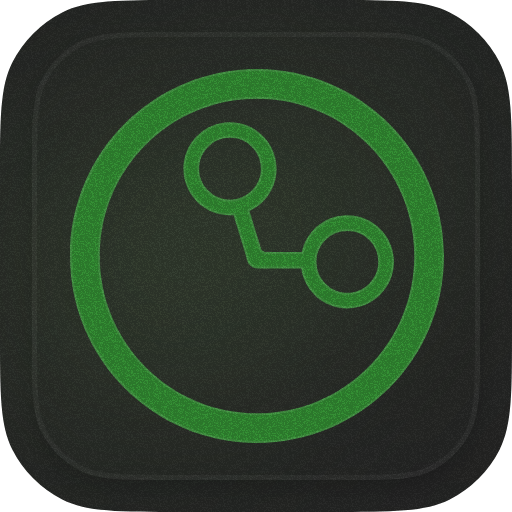

<h1><b>Timelens</b></h1>

  <i>The elegant open source native Rust client for <a href="https://timelens.wierway.ch">timelens.wierway.ch</a></i>

  <table style="border-collapse: collapse;">
    <tbody>
      <tr>
        <td><strong>Download for</strong></td>
        <td>
          <a href="https://github.com/0pandadev/timelens/releases/download/v0.1.1/Timelens-Client-0.1.1.msi">
             <strong>Windows</strong>
          </a>
        </td>
        <td>
          <a href="https://github.com/0pandadev/timelens/releases/download/v0.1.1/Timelens-Client-0.1.1_silicon.dmg">
            <picture>
              
            </picture> <strong>macOS (Silicon)</strong>
          </a>
        </td>
        <td>
          <a href="https://github.com/0pandadev/timelens/releases/download/v0.1.1/Timelens-Client-0.1.1_intel.dmg">
            <picture>
              
            </picture> <strong>macOS (Intel)</strong>
          </a>
        </td>
        <td>
          <a href="https://github.com/0pandadev/timelens/releases/download/v0.1.1/Timelens-Client-0.1.1.AppImage">
             <strong>Linux</strong>
          </a>
        </td>
      </tr>
    </tbody>
  </table>

[discord »](https://discord.gg/invite/Y7SbYphVw9)

> [!IMPORTANT]
>
> ⭐️ **Star this project** to receive all release notifications from GitHub automatically! ⭐️

  
<kbd>✨ Star History</kbd>

  <a href="https://star-history.com/#0pandadev/timelens&Date">
    <picture>
      <source media="(prefers-color-scheme: dark)" srcset="https://api.star-history.com/svg?repos=0pandadev/timelens&theme=dark&type=Date">
      
    </picture>
  </a>

## 🖼️ Preview

While Timelens primarily lives in your system tray for seamless time tracking, here's a peek at its minimal interface when you need it:

## 🚀 Setup

<table>
  <thead>
    <tr>
      <th>Platform</th>
      <th>Token File Path</th>
    </tr>
  </thead>
  <tbody>
    <tr>
      <td> Windows</td>
      <td><code>C:\Users\USERNAME\Documents\timelens\token.txt</code></td>
    </tr>
    <tr>
      <td> Mac</td>
      <td><code>/Users/USERNAME/Documents/timelens/token.txt</code></td>
    </tr>
  </tbody>
</table>
